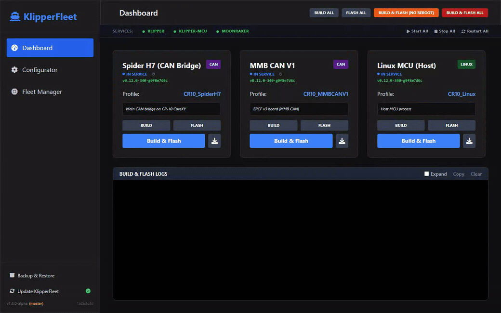
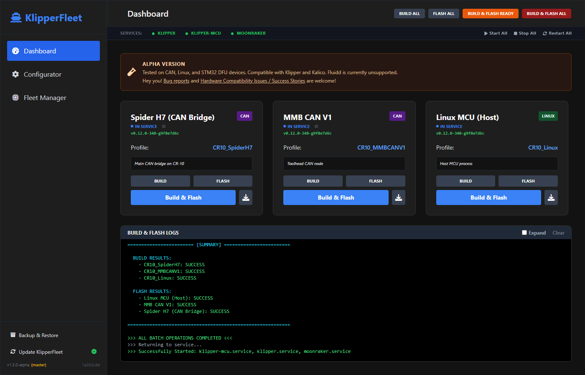
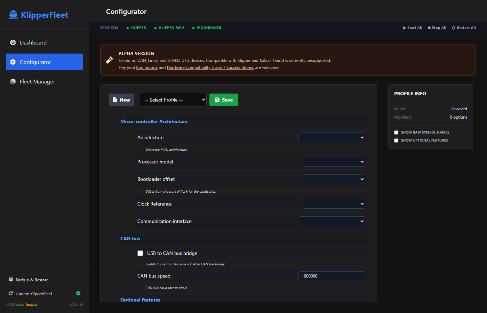
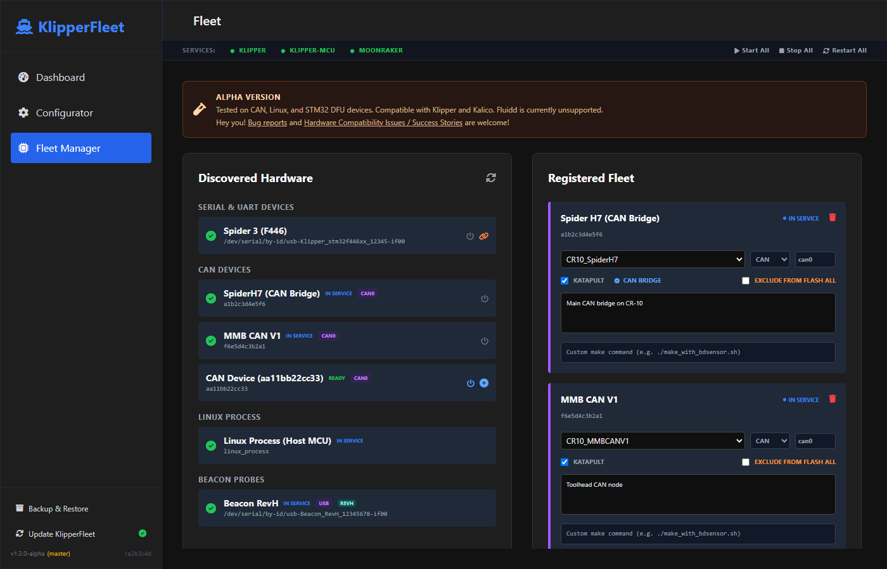
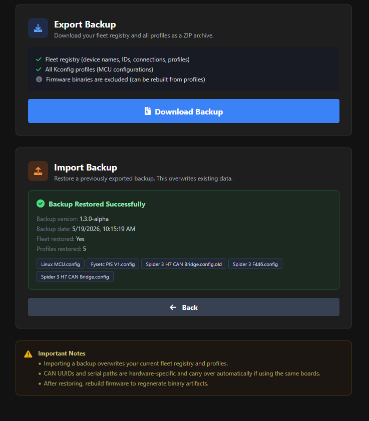

# KlipperFleet

> [!WARNING]
> **ALPHA SOFTWARE** - Tested on specific CAN bus, STM32 Serial/DFU, and Linux Process devices (see below). Non-Raspberry Pi and Fluidd are unsupported but on the roadmap. Kalico is auto-detected if installed at `~/klipper`.
>
> Contributions and [bug reports](https://github.com/JohnBaumb/KlipperFleet/issues) are appreciated!

KlipperFleet is a web interface (integrated into Mainsail) for configuring, building, and flashing Klipper/Kalico firmware across all MCUs on a printer. No command line needed.



*One click builds and flashes every MCU on the printer - CAN nodes, CAN bridge, and host - in the right order, with live logs.*

## Features

- **Web Configurator**: Replaces `make menuconfig` with a reactive web form parsed from Klipper's Kconfig source.
- **Fleet Management**: Register MCUs (Serial, CAN, DFU), assign profiles, and attach DFU IDs to Serial devices for cross-reboot tracking.
- **Smart Sequencing**: Flashes CAN downstream nodes first, bridge hosts last.
- **UART Support**: Detects MCUs connected via Raspberry Pi UART (GPIO).
- **Batch Operations**: Build All, Flash Ready, Flash All, or Build & Flash All in one click.
- **Auto Reboot**: Detects Klipper vs. Katapult/DFU mode and reboots devices into the correct bootloader automatically.
- **Service Management**: Stops/starts Klipper and Moonraker services during flash operations.
- **Integrated Flashing**: Flash via Serial, CAN, or DFU from the browser with real-time log streaming.
- **Backup & Restore**: Export your fleet registry and profiles as a ZIP, or import a previous backup to restore after a fresh install.
- **Mainsail Integration**: Native look and feel within the Mainsail ecosystem.

## Tested Hardware

<details>
<summary>Expand the list of reported boards</summary>

> [!IMPORTANT]
> All other hardware should be considered **untested**. Please [open an issue](https://github.com/JohnBaumb/KlipperFleet/issues) if you run into problems, or share your results in the [compatibility thread](https://github.com/JohnBaumb/KlipperFleet/discussions/2).

| MCU / Board | Connection | Bootloader | Offset |
|-------------|------------|------------|--------|
| Raspberry Pi | Linux | N/A | N/A |
| Spider 3 H7 (H723) | CAN / CAN Bridge | Katapult | 8KiB |
| Spider 3 (F446) | DFU (USB) | STM32 DFU | 32KiB |
| Fysetc Spider V2.2 | UART | Katapult | 32KiB |
| Mellow Super 8 Pro (H723) | USB CAN Bridge | Katapult | 128KiB |
| BTT Manta M8P v2 | USB CAN Bridge | Katapult | 128KiB |
| BTT SKRat 1.0 | USB CAN Bridge | Katapult | 8KiB |
| Fysetc Hexa Distro Fusion | USB CAN Bridge | Katapult | 8KiB |
| Sovol Zero (H750 + F103) | USB CAN Bridge | Katapult | - |
| BTT Octopus v1.1 | USB | STM32 DFU | 32KiB |
| BTT Kraken | CAN | Katapult | 128KiB |
| BTT MMBCAN v1 (G0B1) | CAN | Katapult | 8KiB |
| BTT EBB36 Gen2 | CAN | Katapult | 8KiB |
| BTT EBB36 v1.2 | CAN | Katapult | 8KiB |
| BTT EBB42 v1.2 | CAN | Katapult | 8KiB |
| Fysetc H36 v1.3 | CAN | Katapult | 8KiB |
| Mellow Fly SB2040v3 | CAN | Katapult | 16KiB |
| Mellow ADXL345 (RP2040) | USB | Katapult | 16KiB |
| AFC Lite 1.0 | CAN | Katapult | 128KiB |
| ToquesCAN | CAN | Katapult | 8KiB |
| StrideMax | CAN | Katapult | 16KiB |
| sht36v2 | CAN | Katapult | 8KiB |
| QIDI Plus 4 Mainboard | USB | Katapult | 32KiB |
| QIDI Plus 4 Toolhead | USB to UART | Katapult | 8KiB |
| QIDI Box v2 | USB | Katapult | 32KiB |
| Fysetc ERB 2.0 (RP2040) | USB | No bootloader (USBSERIAL) | - |
| Voron V0 Display | USB | STM32 DFU (manual) | - |

</details>

## Screenshots

<details>
<summary>Expand screenshots</summary>

| Dashboard | Configurator |
|-----------|--------------|
|  |  |
| **Fleet Manager** | **Backup & Restore** |
|  |  |

</details>

## Prerequisites

- **Klipper** at `~/klipper` and **Katapult** at `~/katapult`
- **can-utils** (CAN devices only), **Python 3.9+** with `venv`
- **Passwordless sudo** for `systemctl` and `ip link`

## Installation

Run this one-liner on your Raspberry Pi:

```bash
wget -qO - https://raw.githubusercontent.com/JohnBaumb/KlipperFleet/main/install.sh | sudo bash
```

<details>
<summary>Manual installation</summary>

```bash
cd ~
git clone https://github.com/JohnBaumb/KlipperFleet.git
cd KlipperFleet
sudo chmod +x install.sh
sudo ./install.sh
```
</details>

## Moonraker Integration

Add the following to `moonraker.conf`:

```conf
[update_manager klipperfleet]
type: git_repo
path: ~/KlipperFleet
origin: https://github.com/JohnBaumb/KlipperFleet.git
primary_branch: main
managed_services: klipperfleet
virtualenv: ~/KlipperFleet/venv
requirements: backend/requirements.txt
system_dependencies: install_scripts/system-dependencies.json
is_system_service: False
```

The installer auto-configures the Mainsail sidebar tab via `.theme/navi.json`.

<details>
<summary>Manual sidebar entry (if the tab is missing)</summary>

Enable **Show Hidden Files** in Mainsail settings to see the `.theme` folder, then add:

```json
[
  {
    "title": "KlipperFleet",
    "href": "/klipperfleet.html",
    "target": "_self",
    "icon": "M20,21V19L17,16H13V13H16V11H13V8H16V6H13V3H11V6H8V8H11V11H8V13H11V16H7L4,19V21H20Z",
    "position": 86
  }
]
```
</details>

## Usage

1. **Configurator** - Select a profile, configure MCU settings, click **Save**.
2. **Fleet Manager** - Scan for devices, add them to your fleet, assign profiles. Use **Attach** to link DFU IDs to Serial devices for cross-reboot tracking.
3. **Dashboard** - **Build All** compiles firmware, **Flash Ready** flashes everything already in a flashable state (bootloader-ready, DFU, or direct-flash) without rebooting running devices, **Flash All** reboots and flashes everything, **Build & Flash All** does it all in one click.

> [!NOTE]
> Use **Backup & Restore** (sidebar) to export your fleet registry and profiles as a ZIP, or import one after a fresh install. CAN UUIDs and stable serial paths carry over automatically; if you change USB ports, update the serial paths in the Fleet Manager. Rebuild firmware from the Dashboard afterward to regenerate artifacts.

## Technical Details

<details>
<summary>Expand technical details</summary>

| Component | Technology |
|-----------|------------|
| Backend | FastAPI (Python 3) |
| Kconfig Engine | Klipper's bundled `kconfiglib` |
| Frontend | Vue.js 3, Tailwind CSS |
| Flashing | Katapult `flashtool.py`, `dfu-util`, `avrdude` |

Data lives in `~/printer_data/config/klipperfleet/`: `profiles/` (Kconfig files), `artifacts/` (compiled firmware), `fleet.json` (device registry).

**Flash method reference**

| Device Type | Method | Reboot Technique | Flash Tool | Format | ID Type |
|-------------|--------|------------------|------------|--------|---------|
| CAN Node | `can` | `flashtool.py -r` via CAN | `flashtool.py -f` via CAN | `.bin` | UUID (12 hex chars) |
| Serial + Katapult | `serial` | 1200bps trick -> flashtool.py -r | `flashtool.py -f -d` via serial | `.bin` | `/dev/serial/by-id/...` |
| Serial AVR (no Katapult) | `serial` | None (direct flash) | `make flash` (avrdude) | `.elf` | `/dev/ttyUSB0` etc |
| DFU (STM32) | `dfu` | 1200bps trick or manual | `dfu-util` | `.bin` | Serial number or USB path |
| Linux Process | `linux` | None | `cp` + service restart | `.elf` | `linux_process` |
| Beacon Probe | `beacon` | None (handled by script) | `update_firmware.py` (beacon_klipper) | firmware | `/dev/serial/by-id/*Beacon*` |
| CAN Bridge (Katapult) | `can`->`serial` | 1200bps trick or flashtool.py -r | `flashtool.py -f -d` via serial | `.bin` | UUID -> `/dev/serial/by-id/...` |
| CAN Bridge (DFU) | `can`->`dfu` | 1200bps trick | `dfu-util` | `.bin` | UUID -> DFU serial/path |
</details>

## Roadmap

- Enhanced DFU handling and bridge recovery
- Per Device Profile Import/Export
- User wiki with setup guides and troubleshooting
- Fluidd sidebar integration (already works by adding the Moonraker update manager entry)

## License
GPLv3
